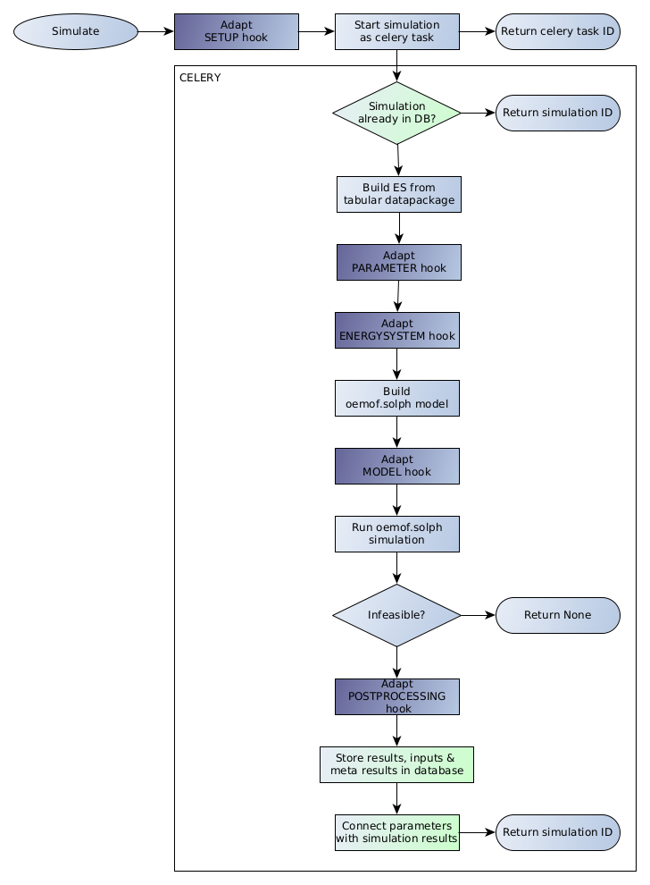

from django_oemof.tests.test_oemof_parameters import OEMOF_DATAPACKAGE

# Django-Oemof

Django-Oemof is a Django app to provide an API to build and optimize oemof.solph models and deliver results via JSON response.

## Requirements

- `oemof.tabular` has to be installed 
- CBC solver has to be installed. Install it via (conda):
```
conda install -c conda-forge coincbc
```

Django project must use celery and automatically detect celery tasks. (follow https://docs.celeryq.dev/en/stable/django/first-steps-with-django.html to setup celery)

## Quick start

1. Add "oemof" to your INSTALLED_APPS setting like this::
    ```
        INSTALLED_APPS = [
            ...
            'rest_framework'
            'django_oemof',
        ]
    ```

2. Include the oemof URLconf in your project urls.py like this::

    path('oemof/', include('django_oemof.urls')),

3. Run `python manage.py migrate` to create the oemof models.
4. Now you can call `/oemof/simulate?scenario=<oemof_datapackage>` in the browser in order to start simulation of an Oemof datapackage. 
   See section [OEMOF Datapackages](#oemof-datapackages) on how to prepare datapackages.

## Configuration

You can set following configs via environment:

- DJANGO_OEMOF_IGNORE_SIMULATION_PARAMETERS
  list of parameter keys which shall be ignored when initializing a simulation 
- DJANGO_OEMOF_TIMELIMIT
  timelimit for cbc solver, default is 600s = 10min

## OEMOF Datapackages

Have to be put in folder `oemof` within Django's `MEDIA_ROOT` folder.
Name of datapackage folder is used in request for building ES.
Once simulation of a scenario is started, the related datapackage will be build using `oemof.tabular`'s [Energysystem.from_datapackage()](https://github.com/oemof/oemof-tabular/blob/09346649f75389d9fdafa62c24ae5e95cc0cf291/src/oemof/tabular/datapackage/__init__.py#L7C1-L7C71).
Afterwards, components and constraints of resulting `oemof.solph.Energysystem` and `oemof.solph.Model` can be adapted/added/deleted using so-called [hooks](#hooks).

## Hooks

Hooks can be used to adapt energysystem and model of the oemof simulation.
This is done by defining custom functions which can be registered in django_oemof and are applied at certain stages while building the ES and optimizing the resulting model.
See following flow chart for order of hooks:



Every hook is scenario-dependent to allow different hooks per scenario, but you can use `hooks.ALL_SCENARIO` as scenario key to apply the hook to all scenarios.

The different hooks are explained in the following:

1. **Setup Hook**
   
   Gets executed before simulation is started. After all related setup hooks have been run, the resulting parameter set will be used to start/lookup simulation. 
   Thus, the setup hook can modify the parameters which will be stored together with simulation results in the database. As these parameters must be JSON-able, no complex parameters (like pandas.DataFrame) can be used here.
   Normally the setup hook is used to handle request data, especially to clean user input using forms.

2. **Parameter Hook**
   
   This hook gets executed right after building ES from datapackage. As a special hook, the resulting parameters dictionary is used to adapt component attributes within the ES. 
   The first key is used to identify ES component, the value, which consists of another dictionary, is used to adapt attributes of the related component 
   (i.e. regarding the dispatch example in `oemof.tabular`, the dictionary `{"demand1": {"amount": 2000}}` would increase load to value 2000 (instead of 1000)).
   Profiles can also be adapted by this hook. In order to do so, a profile given as `pandas.Series` must be set as value instead (i.e. `{"demand0": {"profile": pandas.Series(...)}}`).

3. **Energysystem Hook**

   This hook gets executed after adapting ES from parameter hooks. The underlying function gets access to the `oemof.solph.Energysystem` and can adapt, add or delete components directly within the ES.

4. **Model Hook**

   This hook gets executed after building the optimization model from ES. By this hook, constraints of the model can be adapted, added or deleted.

An example hook (from [digiplan](https://github.com/rl-institut-private/digiplan/blob/0b40cc944a94c8ad73ce95b4d0cc2fd092d91433/digiplan/map/hooks.py#L48), adapting electricity demand) could be set up as follows:

```python
from django_oemof import hooks


def adapt_electricity_demand(scenario: str, data: dict, request: HttpRequest) -> dict:  # noqa: ARG001
    for sector, slider in (("hh", "s_v_3"), ("cts", "s_v_4"), ("ind", "s_v_5")):
        demand = datapackage.get_power_demand(sector)[sector]
        logging.info(f"Adapting electricity demand at {sector=}.")
        data[f"ABW-electricity-demand_{sector}"] = {"amount": float(demand["2022"].sum()) * data.pop(slider) / 100}
    return data


electricity_demand_hook = hooks.Hook(scenario="dispatch", function=adapt_electricity_demand)
hooks.register_hook(hooks.HookType.PARAMETER, electricity_demand_hook)
```

## Visualization

You can get a sankey from result flows by visiting `/oemof/flows?simulation_id=<simuulation_id>`.

**Note:** Unfortunately, all storage components are removed (currently hardcoded), as eChart sankeys do not allow cyclic flows.

This will give you a sankey like this:


## Tests

Run tests for standalone app via `python runtests.py`

## Standalone

This section is about using django-oemof without necessity to set up a django webserver.
You can store/restore simulated oemof.tabular datapackages using djangos ORM.
Additionally, hooks from django-oemof to 
- change parameters before simulation,
- change ES after building from datapackage or 
- changing model before simulating 

are available.

### Usage

Steps to run simulation:
1. Install this package via `pip install django-oemof` or locally via `pip install .`
2. Additionally, `django` and `oemof.tabular` (chose your version freely) must be installed manually
3. Set up database url as `DATABASE_URL` in `.env` file in working directory
4. Migrate django models via `python -m django_oemof.standalone migrate`
5. Download or create a valid oemof.tabular datapackage and store it in folder `media/oemof`
   (Media folder can be changed via `MEDIA_ROOT` in `.env` file)
6. Create script which imports `init_django` from `django_oemof.standalone` 
7. Now, you can save/restore oemof results to/from DB using:
```python
# Example with some hooks
from django_oemof.standalone import init_django
init_django()
from django_oemof import simulation, hooks

OEMOF_DATAPACKAGE = "dispatch"

# Hook functions must be defined beforehand
ph = hooks.Hook(OEMOF_DATAPACKAGE, test_parameter_hook)
esh = hooks.Hook(OEMOF_DATAPACKAGE, test_es_hook)
mh = hooks.Hook(OEMOF_DATAPACKAGE, test_model_hook)

hooks.register_hook(hook_type=hooks.HookType.PARAMETER, hook=ph)
hooks.register_hook(hook_type=hooks.HookType.ENERGYSYSTEM, hook=esh)
hooks.register_hook(hook_type=hooks.HookType.MODEL, hook=mh)

parameters = {}
simulation_id = simulation.simulate_scenario(scenario=OEMOF_DATAPACKAGE, parameters=parameters)
print("Simulation ID:", simulation_id)

# Restore oemof results from DB
from django_oemof import models
sim = models.Simulation.objects.get(id=simulation_id)
inputs, outputs = sim.dataset.restore_results()
```
   
*Note*: `django_oemof.models` must be loaded *AFTER* `init_django()` call. 
Thus, import of `django.models` might look unusual and linter might complain - 
but otherwise django models are not ready yet and a django error will occur! 

